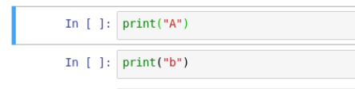
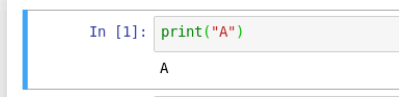
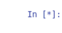
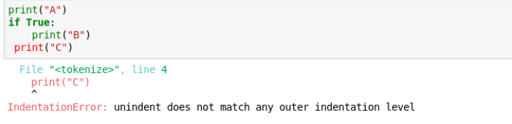

# CS82 Introduction to Machine Learning

## Week 1 - Introduction to Python

### Course Overview

#### Goal

CS82 Primary Goal is to introduce students to Machine Learning and motivate them to become independent in learning and developing their skills further. Machine Learning is a large field that encompasses multiple sciences, such as statistics, theoretical mathematics and even neuroscience. In this course we will transform definitions of concepts to elementary explanations. With the elementary explanations provided in class the student will not require a background in linear algebra. However by elementary it doesn't mean that they will be by nature easy to understand. Effort from students is required to do well in this class. Asking questions and participating would be the fastest and easiest way for students to make the most of this course.

#### Structure

The course consists of Weekly Video Lectures. Each Video Lecture will be structured in the following way:

* Homework Review and Q/A - 10 minutes
* Handout Review - 15 minutes
* Workshop - 35 minutes

#### Expectations

**Time commitment**

To master everything and anything in life takes time. You should under no circumstances expect to be good at this right away. The course is designed so that for every hour of teaching you speed 2 to 3 hours outside of class. That time should be spend, doing the homework, reviewing the current lecture's material, going over the next lecture's material.

**Homework During Summer Semester**

Due to the nature of the classes being only 24 hours apart from each, it will require extra effort from your end to meet the deadlines. This is a 1 month course and hence we don't have a lot of time between classes. That means that it is at your best interest to start the homework right away. 

If you have problems, technical or in understanding the homework, you can get help fast.

The homework will follow closely our workshop and what we looked at in class. 

**Deadline** For each class there will be homework assigned at the end of the class it will be due 8 hours before the start time of the next class. 

Example: if our class is at 7pm EST on Thursday, the Homework is due on 11am EST on Thursday. 

**Homework is submitted via email at danny@ktbyte.com using the subject line `[CS82 Summer] HW1 - Student Name `**

You must attach an .ipybn (Jupyter Notebook) file with all your results and output saved in the Notebook.


### Handouts

Handouts are to be read before class

### Workshops

Workshops are interactive coding sessions by which you have to code along. 

### Final Project

Throughout the semester you will be working on a project due at the end of the semester. Final Project is due the last lecture of class. The final project is a requirement in completing the class.

### Seeking Help

There are no silly questions. If you are stuck at something no matter how small or big, if you can't figure out a solution please email me at danny@ktbyte.com I will be glad to assist.

### Participation

During class it is at your benefit to participate. Having a working microphone helps. Interrupting to clarify a concept is more than welcome. The class time is planned for discussion.

### Distraction and Tardiness 

Please arrive 5 minutes prior to the start time of the class. You must have your programming environment open by the time the class starts. Please be attentive during class. 

### Topics

The topics that will be covered during the semester are the following:

* Python Basics  
* Data 
* Calculus and Linear Algebra
* Regression
* Classification 
* Features 
* Text
* Gradient Descent
* Neural Networks
* Q Learning 
* Clustering
* Dimensionality

For the Full Syllabus Please read: [SYLLABUS](syllabus.html)

### Jupyter Notebook

Jupyter is going to be the development enviroment of our choice. 

You can open jupyter notebook from your Desktop in your VM. 


A browser window of Jupyter Notebook will open and you should see:


We write code inside notebooks. A notebook is a file that contains all our code.

To create a new Notebook we can use the New Button 
and select Python 3 


**REMEMBER** keep all your files inside the **sync** folder if you want them to not be erased when the machine shuts down.

This should take us to our programming interface screen:


Jupyter unlike regular compilers consists of cells. 

- Each cell runs independently of other cells. 

- We can write python code in a cell, Markdown language (markdown was used to write this document and is an easy language to use for formatting text and documenting code, is very similar to HTML). 

- We can even run HTML in a cell.

  **The main strength of Jupyter Notebook is the ability to run cells independently of each other.**

The order in which Cells are executed is on the left. A new session is created when we open the notebook and each cell is numbered on the left in the order it is executing. 


If the brackets are empty that means that the cell has never executed. 


If the cell contains a number it means that the cell has executed in the order of the number in the brackets.

**EXECUTING A CELL**

To Execute a cell you have to:

- Select the cell (It will appear Highlighted ): 
- Hit Shift+Enter **OR**  the Run Button 

**Output**, if there is any, will be printed below the cell. And the number will be added in the brackets



**TERMINATING A CELL**

When a cell is executing (for long processes), inside the brackets a `*` symbol will appear. 

If the process runs indefinitely, it is possible you have an error in your code or what you are executing requires a lot of processing power. In either case if you want to terminate the cell you can:

- Hit the stop button 

  it will terminate the current cell but maintain the notebook state (previously executed cells and memory)

- Shutdown the kernel 

   which will shut down the current notebook and you will lose any results in memory or anything else previously executed. In most cases you will have to re-run every cell to recover your results. 

Once a kernel is shut down, you need to restart it, restarting the kernel has the similar effect as shutting down and restarting it. 


The following examples show how the order we can execute cells impacts the code we write


**NOTICE the numbers on the left of each cell show the order they are executed, we can modify a cell and re-run it**


In each cell we can write and execute code as we would normally do from the terminal, a text editor or dedicated compiler.

```
for i in range(10):
    print(i)
```


**Jupyter Commands Recap** 


- Run executes the program
- Terminate button stops the currently executing cells
- Refresh button, clears the memory and resets the program
- Fast Forward button, clears all the memory and runs the program from the start sequencally

We can use `Shift+Enter` to run an individual cell.

### Virtual Machine

All our work will be performed in your virtual environment. If you are not familiar with it, it will be a good opportunity to explore it at your own pace and be prepared to use it entirely during the class. The virtual environment improves the way the teaching assistants can interact with students. In case the student requires help, the teaching assistant can take control of the virtual environment to assist as needed. Moreover we use the virtual machines to evaluate participation and progress. Lastly you will be using the virtual environment to present or share your project with the rest of the class.

#### Common problems with the virtual machine

Sometimes the machines can get stuck, please try all of the steps below to resolve any issues

1. Click on the black border around the machine and then back into the machine window

   

2. If the problem persists, refresh your browser page

   

3. If the problem persists, please close the browser, all open tabs and all windows and restart it

4. If the problem persists please restart the machine (hit the stop button and then the on button after the machine has completely turned off) 

5. If the problem persists let your instructor know

### Linux Environment

Linux is very similar to a Windows OS or Mac OS environment. However as compared to the other two operating systems Linux is:

- Free
- Well Supported
- Easy to use

There are many packages and tools made for Linux that are especially useful for Machine Learning that makes it ideal for use in this case. Familiarize yourself with the environment.


The most important of the above is the `Jupyter Notebook` as well as your `Home` folder

The **Home Folder** contains all our data. Including the most important folders shown below.


**Downloads** is where most all files downloaded via Firefox will go. 

**Sync** folder is your working directory, anything placed in the sync folder will be kept between sessions. Anything outside the sync directory will be deleted once you restart the VM

**WARNING All of your files will be deleted at the end of the VM session. Keep all files you want to maintain in the sync folder.**

### Linux Terminal

To open the linux terminal, we click at the applications button at the top left corner 

We navigate to the `Terminal Emulator` 

The following window should open


Don't get intimidated by the Linux Terminal. Maybe it doesn't have fancy graphics, animations or buttons to click but it is extremely useful and powerful in helping us get things done.

We pass commands to the terminal to specify what we want to do.

First thing we notice is the `root@97149cf371cb:~#`

root is the name of the current computer user and @97149cf371cb is the name of the current computer/server. After the colon `:`  is the current directory we are in. The home directory is symbolized and shortcuted as `~`

We can type commands in the terminal, few of the commands and things we can do in the terminal easier than a graphical interface is, manipulate files and directories, download datasets, run our programs and install programs.

`cd` lets you enter a directory
`pwd` returns the current directory we are in
`rm` deletes a file
`mv` moves a file
`cp` copies a file
`cat` prints entire file to command line
`tail` prints last few lines of a file to the command line
`head` prints first few lines of a file to the command line
`ls` lists files in current directory
`mkdir` creates folder
`>` saves console output to a file
`>>` appends console output to a file

**Tips**

- Use `TAB` for auto-complete
- Use UP `↑ ` and DOWN `↓` arrows for navigating command history

**Command Arguments**
Running a command also takes arguments, example we can't copy a folder without passing the correct arguments as seen in the example. To do this we need to pass argument `-r`

```bash
cp -r full/path/source_folder full/path/destination_folder
```

#### Command Line Cheatsheet


### File Compression

#### Tar 

is a file format for compression common in Linux systems. To extract a tar archive we use 

`tar -xvf yourtar.tar`

#### Zip

is a file format common in windows systems. To extract a zip archive we use

`unzip yourzip.zip`

###Python

#### Intro

Python is one of the most popular and widely used programming languages. It is especially popular with Machine Learning. The reason is that a lot of libraries are available on python. Most cutting edge research in Machine Learning is published in python. Hence the choice for this course makes sense to be in Python.

Python is also used for web-development, system programming and more. Python can work on multiple platforms (Windows, Linux, Mac) and its syntax is fairly simple and straightforward. It allow us to do prototyping faster than traditional languages due to how relaxed the syntax is and often times we can achieve the same results as other programming languages in much fewer lines. 

We will be using Python 3 throughout the semester. **The current version of Python is 3.7 and it is the version that will be used in this course.** In the future if you do need to use some oddly written library it might require different subversions of Python 3. The differences for example between Python 3.5 and Python 3.7 are minimal. However Python 2 and Python 3 are very different in syntax and the way they work.

Python comes pre-installed with Linux, so you don't have to do much. Many times Python 2 and Python 3 are installed side by side on a system. Installing packages on Python 3 do not automatically install them for Python 2. Some useful commands you can use to figure out which python you are using on terminal are:

`which python`  location of python command

`which python3 ` location of python3 command

`python3 -V` version of python3

`python -V` version of python command

often times python is installed as python2, python3, python, python3.5 python3.7 etc. This is for using different versions of python. 


#### Variables

Variables can be declared without specifying the type. Also Python doesn't check if a variable exists until it is called. That is because it is interperted. For example you could try to print a variable that doesn't exist but you will only get an error during run time (There is no compilation).

```python 
myvar=1
print(myvar)
myvar+=1
print(myvar)
myvar-=1
print(myvar)
#this is a one line comment
"""
this
is a 
multiline 
comment
"""
print(error_var) #this should give you an error

myvar="!"
print(myvar) # this reassigns myvar to a string "!"
myvar+="?"
print(myvar)
```

#### Data Structures

* Lists

  Are ordered items, the order is always maintained. Lists can contain multiple types of variables, example string and integer together and even other lists or data structures

  **Example of operations**

  ```python
  mylist=[1,"A",["a",2]]
  print(mylist[0]) # prints the first item
  # 1
  print(mylist[-1]) # prints the last item
  # ['a', 2]
  print(mylist[-2]) # prints the second from the last item
  # A
  print(mylist[:1]) # prints first item
  # [1]
  print(mylist[:]) # prints entire list
  # [1, 'A', ['a', 2]]
  print(mylist[-2:]) # prints last 2 items
  # ['A', ['a', 2]]
  print(mylist[:1]) #prints first item
  # [1] 
  mylargelist=list(range(100)) # range creates an object that has integers from 0 to 99, list is converting that object to type list
  mylargelist[::1] # print all numbers with step 1
  # [0, 1, 2, 3, 4, 5, 6, 7, 8, 9, 10, 11, 12, 13, 14, 15, 16, 17, 18, 19, 20, 21, 22, 23, 24, 25, 26, 27, 28, 29, 30, 31, 32, 33, 34, 35, 36, 37, 38, 39, 40, 41, 42, 43, 44, 45, 46, 47, 48, 49, 50, 51, 52, 53, 54, 55, 56, 57, 58, 59, 60, 61, 62, 63, 64, 65, 66, 67, 68, 69, 70, 71, 72, 73, 74, 75, 76, 77, 78, 79, 80, 81, 82, 83, 84, 85, 86, 87, 88, 89, 90, 91, 92, 93, 94, 95, 96, 97, 98, 99]
  mylargelist[::2] # print all numbers with step 2
  # [0, 2, 4, 6, 8, 10, 12, 14, 16, 18, 20, 22, 24, 26, 28, 30, 32, 34, 36, 38, 40, 42, 44, 46, 48, 50, 52, 54, 56, 58, 60, 62, 64, 66, 68, 70, 72, 74, 76, 78, 80, 82, 84, 86, 88, 90, 92, 94, 96, 98]
  mylargelist[:10:2] # print all numbers in range 0-9 with step 2
  # [0, 2, 4, 6, 8]
  mylargelist[1:10:2] # print all numbers in range 1-9 with step 2
  # [1, 3, 5, 7, 9]
  mylargelist[1:10:3] # print all numbers in range 1-9 with step 3
  # [1, 4, 7]
  emptylist=[]
  emptylist+=[0,1] # combine two lists
  # [0, 1]
  emptylist+=[2]
  emptylist.append(1) # add element to the end
  # [0, 1, 2, 1]
  emptylist.remove(0) # remove first element that equals to 0
  # [1, 2, 1]
  emptylist.remove(1) # remove first element that equals to 1
  # [2, 1]
  emptylist+=[1,1,1]
  emptylist.pop(0) # remove first element
  # [1, 1, 1, 1]
  ```

  **Notes:**

  1. Please note the negative indexing. It is very useful in addressing a list in reverse order.

  2. Please note the `:` is used to address a list range, not specifying the number means that it will go over the entire range in the side of the unspecified index

  3. Please note that two  `:` is used to address a list range **and** step, not specifying the number means that it will go over the entire range in the side of the unspecified index

  4. Table of all functions available to lists

     | append()  | Adds an element at the end of the list                       |
     | --------- | ------------------------------------------------------------ |
     | clear()   | Removes all the elements from the list                       |
     | copy()    | Returns a copy of the list                                   |
     | count()   | Returns the number of elements with the specified value      |
     | extend()  | Add the elements of a list (or any iterable), to the end of the current list |
     | index()   | Returns the index of the first element with the specified value |
     | insert()  | Adds an element at the specified position                    |
     | pop()     | Removes the element at the specified position                |
     | remove()  | Removes the first item with the specified value              |
     | reverse() | Reverses the order of the list                               |
     | sort()    | Sorts the list                                               |

* Tuples

  Tuples are an imutable datatype (this means that once they are defined they can not be changed). They are ordered, that means that the order of the elements is preserved and it's important. They are defined using parenthesis `()` instead of brackets `[]`, they have similar operations to lists. **However you can't change the contents of a tupple**, but you can create a new tupple out of an old tupple and append contents to it. The main advantage of the tupples is:

  * Tupples have smaller size
  * Tupples can be used as keys to dictionaries (**More on that later**)

  **Example**

  ```python
  mytupple=(0,1,2,3)
  mytupple[1]
  # 1
  mytupple[1:]
  # (1, 2, 3)
  mytupple+=(1,2,3)
  # (0, 1, 2, 3, 1, 2, 3)
  mytupple[0]=1
  """
  Traceback (most recent call last):
    File "<stdin>", line 1, in <module>
  TypeError: 'tuple' object does not support item assignment
  """ 
  ```

  

* Dictionaries

  Dictionaries are unordered structures of data that can only be indexed by a key. That key can be a **tupple**, integer, float, or any immutable object. They are defined using brackets `{}` and they have the format of key - value pair `key:value` and accessed using the key `dict[key]`.  

  **Example**

  ```python
  mydict={"A":"b",1:10,(0,1):5}
  mydict["A"]
  #'b'
  mydict["B"]
  """
  Traceback (most recent call last):
    File "<stdin>", line 1, in <module>
  KeyError: 'B'
  """
  mydict["B"]=1
  mydict["B"]
  # 1
  mydict[1]
  # 10
  mydict[(0,1)]
  # 5
  mydict[[0,1]]
  """
  Traceback (most recent call last):
    File "<stdin>", line 1, in <module>
  TypeError: unhashable type: 'list'
  """
  ```

#### Error Comprehension

* Syntax Errors

  Syntax errors are caused from Badly formated code, typos, mispellings and are generally resolved fairly easily by looking at the code and determining what is wrong. 

  The location of the error is usually pointed out at us. 

  **Example**

  ```python
       t="A"
  """
    File "<stdin>", line 1
      t="A"
      ^
  IndentationError: unexpected indent
  """
  
  ˜d
  """
    File "<stdin>", line 1
      ˜d
       ^
  SyntaxError: invalid character in identifier
  """
  ```

  **Notes**

  * Pay attention to the location of the `^` character. it points at **EXACTLY** where the syntax error is. 
  * Pay attention to the File name (in this case it is stdin which means I am using the interperter directly) as well as the line number. It will make finding the error easier
  * Pay attention to the error name, in this case **SyntaxError**. As well as the error description. 

* Exceptions

  There can be less obvious errors that require further understanding in locating them. Errors such as TypeError are very common. The main way of locating and correcting them is based on the line number. These errors can be mainly caused during execution, because we are doing something that is not allowed. 

  **Example**

  ```python
  tup=(0,1,2)
  tup[0]=1
  """
  Traceback (most recent call last):
    File "<stdin>", line 2, in <module>
  TypeError: 'tuple' object does not support item assignment
  """
  ```

  Notes:

  * Identify the line, and the file, locate the error and try to understand the error message
  * Correcting the error is based on your best judgment, there is no guide. It could be caused by a mistake we are doing before, in this case it could have been that we want tup to be a list, or we want to convert it to a list before making the assignment. 

#### Control Flow

**If statements**

If statements help control the flow of the program. The most common use case in this course would be during data preprocessing. We would want to check if a row in our data meets some criteria to process it accordingly. We use `TAB` or `SPACE` to correctly structure our code instead of brackets `{}` as we use in other languages. **More on that later**

We can construct logical expressions using the keywords  `not` , `and` and `or`

Example

```python
if True:
	print("A")
#A

a=4
b=2
if a>b:
	print("a is larger")
	
# a is larger

if not b>a: # equivalent as above
	print("a is larger")
	
# a is larger

```

**For Each**

if we have a list of items example:

`
a=[1,2,3,4,5,6]
`
and we want to loop over all of them, a very easy way to do that is the following for loop structure

```python
for element in a:
    print(a)
```

**For Range**

If we want to loop over a range of integers e.g. 0 to 9 the following for loop structure will help.

```python
for i in range(10):
    print(i)
```

* Range returns an object range of numbers from the numbers specified, we can even put two numbers in range e.g. range(10,20) for 10-19

**Intendention**

Structure of Python program matters, we can't have badly intendent code. Indentation is the way the program is structured horizontally. Think of paragraphs when you write an essay. We control indentation using `TAB` button or `Space` . **BUT NOT BOTH** using both `TAB` and `SPACE` will lead to confusing results and errors. We don't need a main function to run a python program we can just write our code.

Example:

```python
print("Hello World")
```

An if statement is python is simply:

```python
s="Hello World"
if len(s)>0:
    print(s)
```

Notice the colon at the end of the if statement.

- len() is a function that returns the length of the string.

Indentation is important, **the following will not run**

```python
s="Hello World"
if len(s)>0:
    print(s)
else:
print("empty string")

"""
  File "<stdin>", line 4
    print("empty string")
        ^
IndentationError: expected an indented block
"""
```

**the following will not produce expected results**

```python
s="Hello World"
if len(s)>0:
    print(s)
else:
    print(s)
print("empty string")
```

**TABS vs SPACES** 



Badly indented code can cause errors. 1 Tab is not always equal to 1 Space. Copy pasting code can often cause errors because of how different systems interpret tabs vs spaces. **In this couse we will be using tabs**. 

#### Functions

Functions can be used to declare logic that we repeatedly need. This avoids having to rewrite the same piece of code multiple times. We will mostly use existing functions, but often times you might find yourself in need of writing your own. The example below demonstrates how to declare and use a function.

```python
def my_function(param1,param2):
	return param1+param2

my_function(1,2)

# 3
```

Many functions in the libraries we will use have default parameters. These are parameters we don't have to pass but take a default value. Example is shown below

```python
def my_function(param1=1,param2):
	return param1+param2

my_function(1)

# 2

my_function (3,2)

# 5
```

Please note that default parameters go to the end, the following is **invalid**, 

```python
def my_function(param1=1,param2): # ERROR
	return param1+param2
```

We can also specify exactly which parameter we are passing by calling it by name when many default parameters are available to us. 

```python
def my_function(param1=1,param2=2,param3=3,param4=4):
	return param1+param2+param3+param4


my_function()

#10

my_function(param2=1)

# 9 

my_function(param3=1)

# 8 

my_function(param3=0,param2=0) # order doesn't matter when specifying parameter name

# 5
```

#### Importing and Working with Libraries

Libraries help us use existing functionality instead of writing things from scratch. Libraries can be installed by running on terminal, the following command will install the library as well as the depedencies (libraries required to be installed because they are used by that library)

`pip install library-name`  

Libraries come with prepackaged functionality that help us do redudant tasks. An example would be that we don't want to write a function for calculating the average between 100 numbers. One reason would be that we might make a mistake in this implementation we are making of our own as well as we are wasting time doing something very fundamental that many other people have solved before us. It is always preffered to use a library for some functionality when a library is available. 

To import a library we just installed we can use 

`import library-name`  **note that sometimes the library-name we used to install and the library-name we use to import can differ**

to import a module from a library we use 

`from library-name import module-name`

To use the library we just imported we can do

`library-name.somefunction()`

to use the module we just imported we can do

`library-name.somefunction()`

To use a function from a module we can do (as long as we have imported both the library and the module)

`library-name.module-name.some_module_function()`

**or**

`module-name.some_module_function()`

Many times to make things easier for us programmers instead of writing long module-names and library-names every time we need to import something, we rename them during importation. The syntax for that is the following:

`import library-name as ln`

and then we can use `ln.function_name()` instead of `library-name.function_name()`

Throughout this semester we will use the following main libraries (some other libraries will briefly be used throughout the course)

| Library Name | Description                                                  | Link to API                                                  |
| ------------ | ------------------------------------------------------------ | ------------------------------------------------------------ |
| numpy        | It contains powerful functions and tools for manipulating matrices (very large tables), the main advantage of numpy is that it is computationally fast and provides tools and operations that make manipulating data easy. | https://docs.scipy.org/doc/numpy-1.15.1/reference/           |
| pandas       | Similarly to numpy contains operations for matrices and **dataframes** (a type of datastructure, think of a matrix/very large table) it adds additional functionality for manipulating data. | https://pandas.pydata.org/pandas-docs/stable/reference/index.html |
| matplotlib   | Visualization library                                        | https://matplotlib.org/3.1.0/api/index.html                  |
| sklearn      | Machine Learning library                                     | https://scikit-learn.org/stable/modules/classes.html         |

The API is the most important page of the library, we **shouldn't** **memorize** or know it from heart, because it would be pointless, but we should be **experts at navigating** . API change all the time, so memorizing it offers no benefit. API contains information about the modules and functions as well as the implementation details of each library. When we need to perform a task related to Machine Learning, we would look at the sklearn API. 

For example, we can find in the Sklearn library the datasets module that help us load and work with **toy datasets** (datasets that are only meant for testing our machine learning algorithms and offer no significant value in solving real world problems)


Below the description of the module we can find the functions included in the dataset as well as their description.


Clicking on one of the functions we can see information on how to use the function and what it does.


in this case to use this function we would write 

```python
from sklearn import datasets
diabetes_dataset=datasets.load_diabetes()
```

The following are equivalent

```python
import sklearn
sklearn.datasets.load_diabetes()
```

or

```python
import sklearn as skl
skl.datasets.load_diabetes()
```

or

```python
from sklearn import datasets as dt
dt.load_diabetes()
```


w