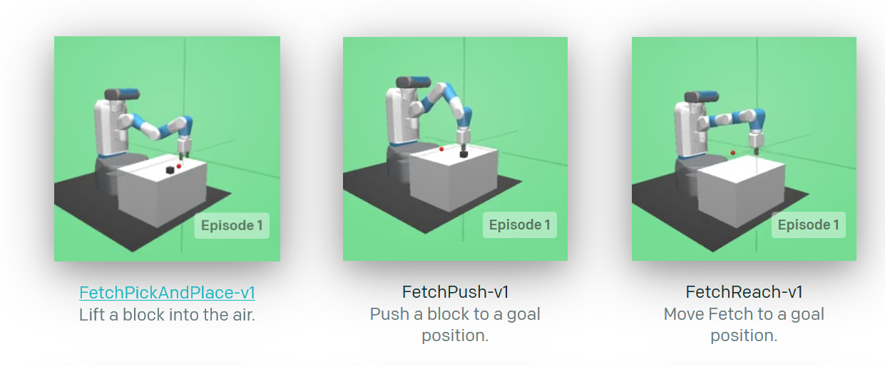
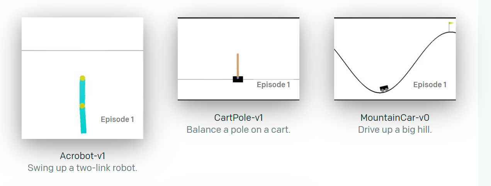
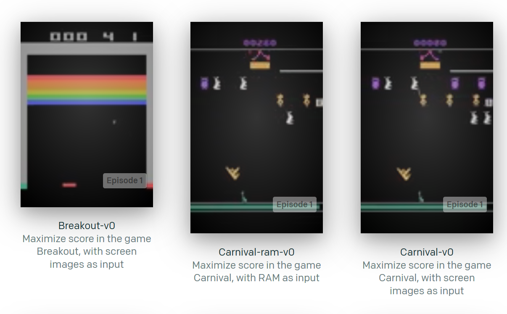
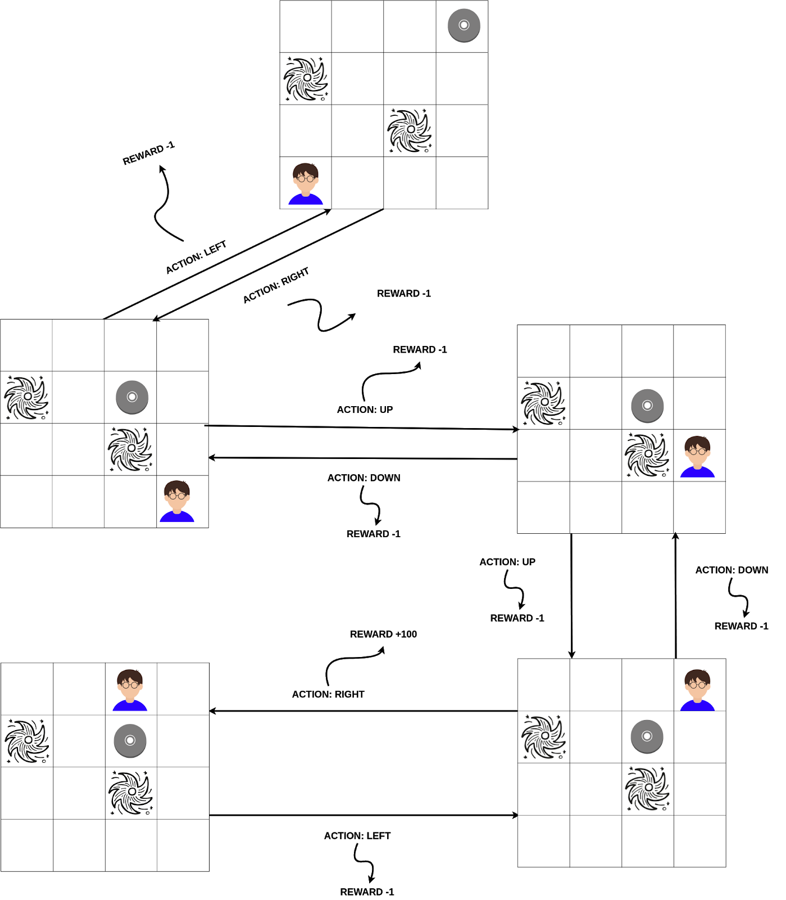
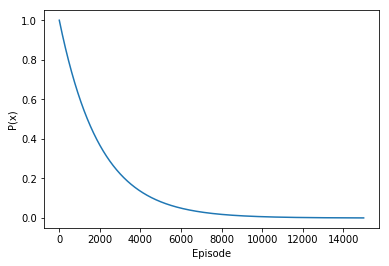

# CS82 Introduction to Machine Learning
## Handout 10 - Q Learning
___

## Contents:
 * Reinforcement Learning 
 * MDP Model
 * Q-Learning Algorithm
 * OpenAI GYM

## Reinforcement Learning


Reinforcement Learning (**RL**)is a class of Machine Learning algorithms that solve problems that involve an agent within a **environment** that needs to take **actions** to maximize its **rewards**. A RL algorithm requires that we clearly define 3 things.

-1556339757040.png)

* **Environment**: Where does the agent take actions. The agent takes actions within a given enviroment, the environment can be:

  * **discrete** or **continuous**, 

    environments that have a grid-like structure of distinct positions as opposed to environments that have continuous values used for the positioning. 

    Example of Discrete Environment Chess (Each position can be encoded as an 8x8 table) as opposed to continuous environment Fortnite that each position is a continuous float number x,y,z

  *  **fully-observable** or **partially observable** 

    Environments that we can observe fully the entire space, that is environments that have no hidden knowledge as opposed to environments for which we can't observe fully or there is partial information. 

    Stockmarket is a fully-observable environment, we know the entire history of a stock as well as the current stock price if we are trying to make a decision to buy or sell a stock. 

    Poker (the card game) on the other hand we don't have a fully-observable environment, we don't know the opponents cards.

  * **deterministic** or **stochastic** 

    environments for which each action leads to a specific outcome as opposed to environments that each action can lead to random outcomes 

    Playing Chess, each action we take is deterministic, we are guaranteed to move queen to Square A1 if it is a valid move and is our turn. Compared to self-driving cars that we might want to steer the car by 10 degrees but due to slippery road it steers 12 degrees.

  * **static** or **dynamic** 

    A static enviroment changes only by the actions of the agent, as opposed to a dynamic enviroment that changes over time by  other processes. 

    An example of a static environment is Chess as opposed to any problem taking place in our Physical World

  * **Episodic** or **Non-episodic**

    An episodic environment is one for which an agent has to take actions in turns as opposed to multiple agents taking actions at the same time. 

    Chess is an episodic environment while Fortnite is non-episodic

    

  An environment can be multiple of those things together. For example: Chess is a **discrete, fully-observable, deterministic, static and episodic ** environment. 

* **Actions:** The actions the agent can take in an environment depend on the environment itself and the problem we try to solve. If we are trying to make a stock-broker agent, the actions of that agent are going to be **buy stock**  or **sell stock**. If our agent is a Fortnite player, our actions can be **Move forward,backward, right,left for x seconds**, **shoot** and more. 

* **Rewards:** Rewards are defined by us, as something we want to have the agent maximize. Depending on the problem we can define different rewards. For example, on a Fortnite game we might want to maximize the number of kills or the time we spent alive. Each of these rewards will lead to an agent taking different strategies to maximize the rewards. An agent that is rewarded for higher number of in-game kills will be more aggressive as opposed to an agent rewarded for staying alive which will play more conservatively. **For each action the agent takes, it has to maximize the overall reward function**

### Mathematical Model for Reinforcement Learning

Markov Decision Process (**MDP**) is a method by which we can convert a real world problem into a problem we can solve using Reinforcement Learning algorithms. **MDP can't map all types of environments** 

MDP models require:

* Finite number of environment states 
* Fine number of actions
* Deterministic or Stochastic environments
* A reward function for each action

The Above are defined as follows:

*  S the list of states
* A the list of actions
* $P_a (s,s_{new})$ is the probability that action $a$ will take us from state $s$ to state $s_{new}$ the probability for a deterministic environment is 1
* $R_a (s,s_{new})$ is the reward we receive if we take action a to go from state $s$ to state $s_{new}$

There are extensions to the classic MDP model such as POMDP (Partially Observable Markov Decision Process) for partially observable environments. We won't go into detail on all of the Markov Models, but depending on the environment we can define more variables and constraints to map a real world problem into a mathematical model.

Each problem and environment requires its own approach in solving it. Our goal is to map a problem's definition to that of an **MDP** model.

**Example** 

The problem of playing chess can be modeled via an MDP process, we need to map the states of a chess to the states of an MDP. In this case the orientation of the board pieces in the 8x8 grid are all the possible states (which is extremely large called the Shannon number) $10^{120}$ . The list of actions are move $Soldier_{1}$ forward or move $Queen$ forward by 1 square, $P_a$ is always one and $R_a$ can be the number of pieces of the opponent we have taken. 

### Q-Learning Algorithm

It is an algorithm that is able to solve an MDP model. This algorithm learns which action to take at each given state so that it can maximize its reward, we call this the **policy** of an agent. 

Q-Table stands for **Quality** Table, which is a map of all actions to all states. That is each column is an action while each row is a a state. Each value $Q[i,j]$in the QTable signifies the quality points of taking action $a_j$ at state $s_i$  The policy of an agent is learned by learning the best values for the Q-Table. At each given state we pick the action with the most quality points. 


We update the Q-Table by taking different actions and examining their outcomes. Assuming we are at a state $s$ which we will name $s_{current}$ and we take an action $a_{taken}$ we will update the value of the Q table for state $s_{current}$ and action $a_{current}$ by examining the outcome of that action and seeing the future potential rewards that this action can lead us to. This idea is described in one equation or **update rule** . 

The update rule for a Q Table is the following:

$ Q [s_{current}, A_{taken}] = Q[s_{current},A_{taken}] + \alpha \times ( r_{taken} +\gamma \times max(Q[s_{new},A_{all}])-Q[s_{current},A_{taken}])$

* Learning rate is $a$ similar concept to gradient descent. It describes how important are new observations as opposed to older ones. Higher learning rate will prioritize newer observations as compared to older ones. 
* Discount rate $\gamma$ signifies the importance we want to place into future rewards as opposed to immediate rewards. Placing higher important to future rewards can lead our agent in making worse decisions short term but with the potential of maximizing their reward function in the long term.

**Pseudocode**

```
INITIALIZE: Create Q table of size M x N where M is the number of states and N is the number of actions. 

WHILE TRUE:

	CHOOSE ACTION: Select the action that corresponds to the maximum Quality points for the given state (row) we are in, from the Q-Table
	RECEIVE REWARD: Observe the reward we obtained by taking the action above
	UPDATE Q-Table: Update Q table with the update rule of our choice
```

```
qtable[state, action] = qtable[state, action] + learning_rate * (reward + gamma * np.max(qtable[new_state, :]) - qtable[state, action])
```


### OpenAI GYM

OpenAI Gym provides an environment in which we can train different agents to perform different set of tasks, from manipulating objects to playing games







Those environments are used to test the performance of a Q-Learning algorithm. That is how fast can a Q-Learning algorithm reach an **optimal** policy. That is the values in the Q-Table are the best they can be such as that the agent takes the **best** action at every given state.

**In practice**

We will consider Frozen Lake problem

<https://gym.openai.com/envs/#toy_text>

```
Winter is here. You and your friends were tossing around a frisbee at the park when you made a wild throw that left the frisbee out in the middle of the lake. The water is mostly frozen, but there are a few holes where the ice has melted. If you step into one of those holes, you'll fall into the freezing water. At this time, there's an international frisbee shortage, so it's absolutely imperative that you navigate across the lake and retrieve the disc. However, the ice is slippery, so you won't always move in the direction you intend.

The surface is described using a grid like the following:

SFFF       (S: starting point, safe)
FHFH       (F: frozen surface, safe)
FFFH       (H: hole, fall to your doom)
HFFG       (G: goal, where the frisbee is located)

The agent controls the movement of a character in a grid world. Some tiles of the grid are walkable, and others lead to the agent falling into the water. Additionally, the movement direction of the agent is uncertain and only partially depends on the chosen direction. The agent is rewarded for finding a walkable path to a goal tile.
```

### Create an Environment in Python

```python
import numpy as np
import gym
import random
env = gym.make("FrozenLake-v0")
action_size = env.action_space.n
state_size = env.observation_space.n
qtable = np.zeros((state_size, action_size))
print(qtable)
```


**.png)**




**We represent our Decision Process using a Q-Table. The goal of Q-Learning is to find the values in the Q table**

| **Q-Table** | **ACTIONS** |          |           |         |      |
| ----------- | ----------- | -------- | --------- | ------- | ---- |
| **UP**      | **DOWN**    | **LEFT** | **RIGHT** |         |      |
| **STATES**  | **S(0)**    | 0        | 0         | 0       | 0    |
| **S(1)**    | 0           | 0        | 0         | 0       |      |
| **...**     | **...**     | **...**  | **...**   | **...** |      |
| **S(14)**   | 0           | 0        | 0         | 0       |      |
| **S(15)**   | 0           | 0        | 0         | 0       |      |

### AFTER QLEARNING

| **Q-Table** | **ACTIONS** |          |           |         |      |
| ----------- | ----------- | -------- | --------- | ------- | ---- |
| **UP**      | **DOWN**    | **LEFT** | **RIGHT** |         |      |
| **STATES**  | **S(0)**    | 0.321    | 0.943     | 1.5     | 6.91 |
| **S(1)**    | 0.642       | 100.0    | 12.3      | 10.59   |      |
| **...**     | **...**     | **...**  | **...**   | **...** |      |
| **S(14)**   | 16.95       | 3.42     | 8.93      | 4.92    |      |
| **S(15)**   | 20.3        | -29.10   | -50       | -2.4    |      |


### Taking An Action

```
            action = np.argmax(qtable[state,:])
env.step(action)

```


### Training in Python

```python

total_episodes = 15000        # Total episodes

learning_rate = 0.8           # Learning rate 

max_steps = 99                # Max steps per episode - We don't want our game to run forever

gamma = 0.95                  # Discounting rate - Rewards now vs Rewards in the future

scores = []

# 2 For life or until learning is stopped
for episode in range(total_episodes):
    # Reset the environment
    state = env.reset()
    step = 0
    done = False
    total_score = 0
    
    for step in range(max_steps):
        # Greedy
        if random.uniform(0, 1) > np.exp(-0.005*episode) :
        # Check to see if any action is available for us to take
        #if qtable[state,:].any():
            action = np.argmax(qtable[state,:])
        # Else doing a random choice --> exploration
        else:
            action = env.action_space.sample()
            
            
        
        # Take the action (a) and observe the outcome state(s') and reward (r)
        new_state, reward, done, info = env.step(action)

        # Update Q(s,a):= Q(s,a) + lr [R(s,a) + gamma * max Q(s',a') - Q(s,a)]
        # qtable[new_state,:] : all the actions we can take from new state
        
        # TODO: In-Class Excercise Fill in the line
        qtable[state, action] = qtable[state, action] + learning_rate * (reward + gamma * np.max(qtable[new_state, :]) - qtable[state, action])
        
        
        
        total_score += reward
        
        # Our current state is the new state
        state = new_state
        
        # If done (if we're dead or Goal state) : finish episode
        if done == True: 
            break
        
    scores.append(total_score)

print ("Score over time: " +  str(sum(scores)/total_episodes))
print(qtable)
```

### Improve Q-Learning

How can we improve the Q-Learning algorithm to learn faster?

There are many ways to introduce improvements. Some ways include:

* The way we initialize the Q Table
* The reward function
* The Update rule 
* The way we choose the action we perform.

### Optimizing the choice of action

We can choose the action that maximizes our reward, at each state, but when we don’t know anything about the environment we don’t have any information available to make our decision. 

**Approaches:**

- Always choose the maximum reward action

- Strategize our choice of action

  * Random -> Exploration

  - Maximum -> Exploitation


### Exploration vs Exploitation

It is called greedy, because we don’t care about the best solution. We are being greedy to quickly find a solution, but not a quick/best solution. 

- Start by exploring, choosing random actions
- Continue in next episodes by exploiting known good actions

Decay the probability as more episodes pass that we will choose exploration vs exploitation. This is because we assume that with enough episodes we would have less of a need to randomly pick and have better understanding of the most efficient choice of actions. 

We start by favoring exploration (due to lack of knowledge about the game) and we continue by favoring exploitation, choosing the maximum reward action. 

`if random.uniform(0, 1) > np.exp(-0.005*episode)`

```python
import matplotlib.pyplot as plt
    
plt.plot(np.exp(-0.0005*np.arange(total_episodes)))
plt.ylabel("P(x)")
plt.xlabel("Episode")
plt.show()
```




$P(x)$ is the probability we will choose Exploration, a random action. For starting episodes we are more likely to choose exploration. 

```
        # Greedy
        if random.uniform(0, 1) > np.exp(-0.005*episode) :
        # Check to see if any action is available for us to take
        #if qtable[state,:].any():
            action = np.argmax(qtable[state,:])
        # Else doing a random choice --> exploration
        else:
            action = env.action_space.sample()
            
            
```

